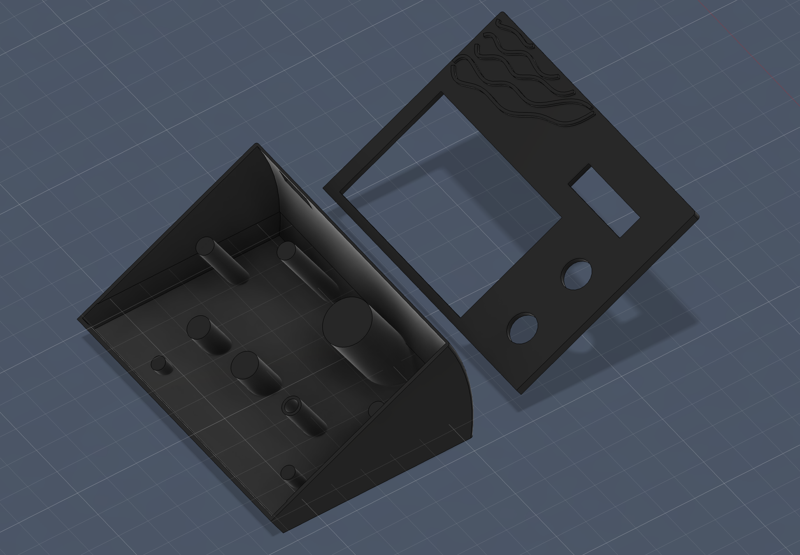
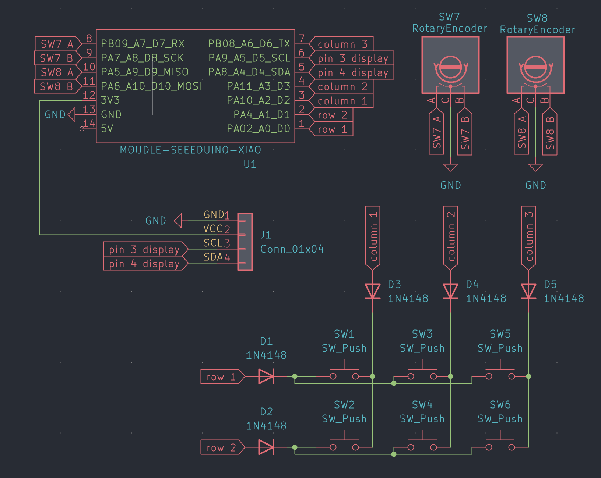

## MacRo Pad

A compact macropad with 6 keys, 2 rotary encoders, and a small OLED display.  
It’s designed for quick media control, productivity shortcuts, and future smart home integration.  
Currently built for macOS. Home Assistant integration and Windows support will be added once the hardware is available.

---

## Overview

| Render | Case | Schematic | PCB |
|--------|------|-----------|-----|
|  |  |  |  |

---

## Bill of Materials

| Part | Quantity | Notes |
|------|--------|------|
| Seeed XIAO RP2040 | 1 | Main microcontroller |
| MX-style switches | 6 | Mechanical switches |
| DSA keycaps | 6 | Keycaps |
| EC11 rotary encoders | 2 | Rotation only |
| 0.91" OLED display (SSD1306) | 1 | I2C |
| 1N4148 diodes | 6 | Key matrix |
| Custom PCB | 1 | Designed in KiCad |
| 3D printed case | 1 | Custom enclosure |
| M3 screws | 1 | Assembly |
| M3 heatset inserts | 1 | Mounting |
