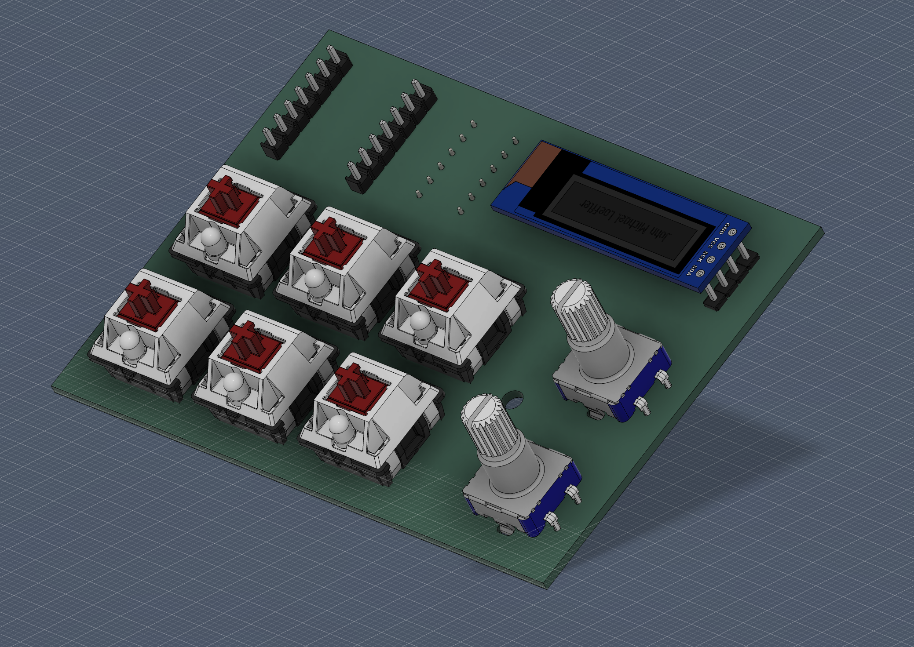
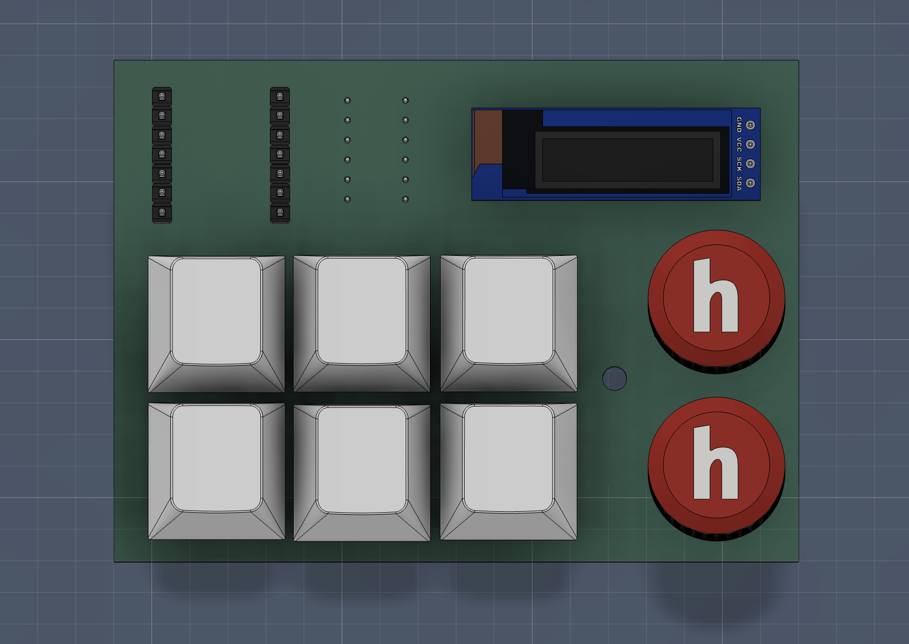
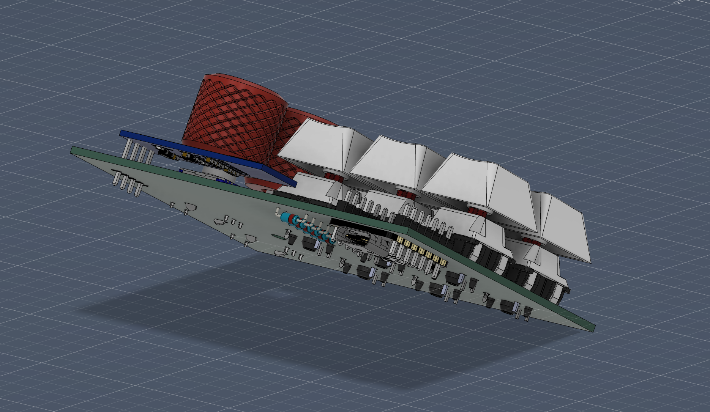

PCB design files for the macropad.
The assembly is made in fusion
## PCB Design

| Schematic | PCB (no buttons) |
|-----------|------------------|
|  |  |

| PCB Front | All Components |
|-----------|---------------|
|  |  |
